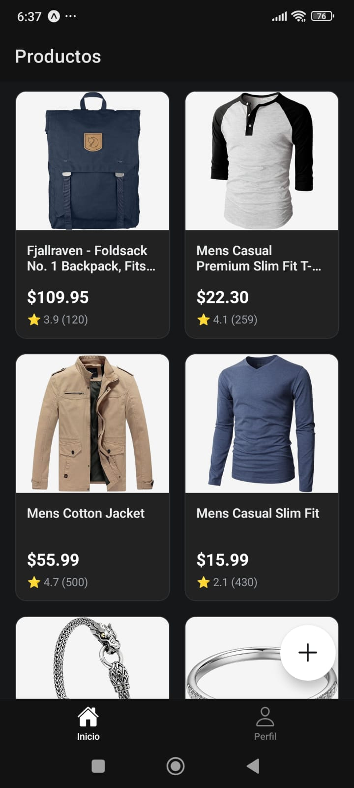
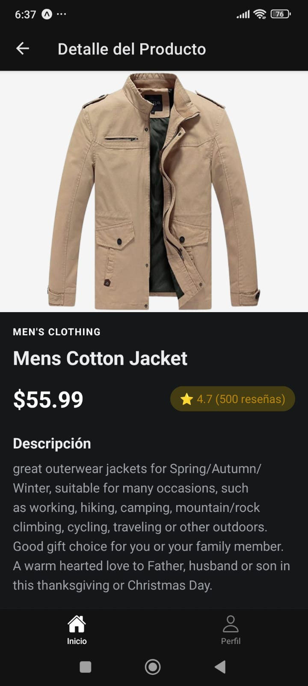
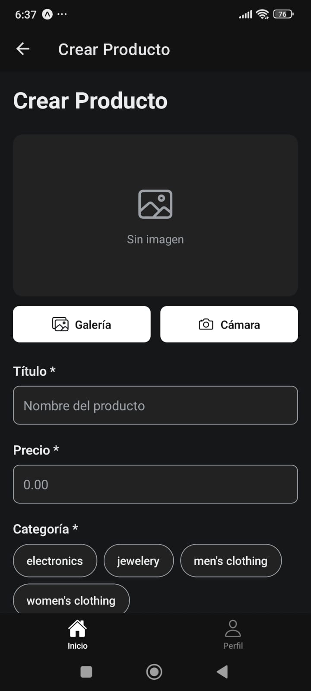
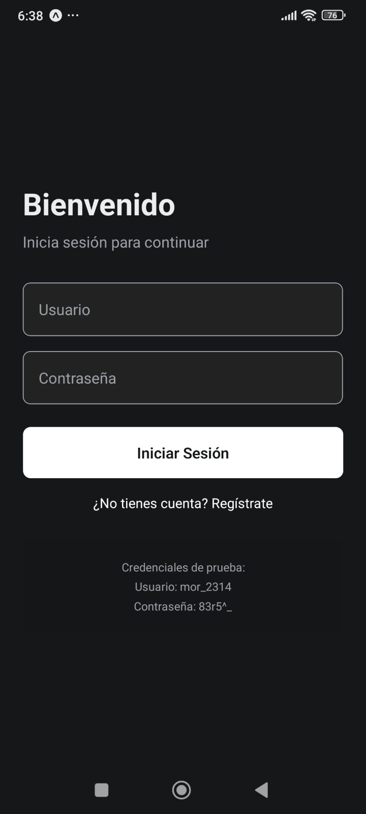
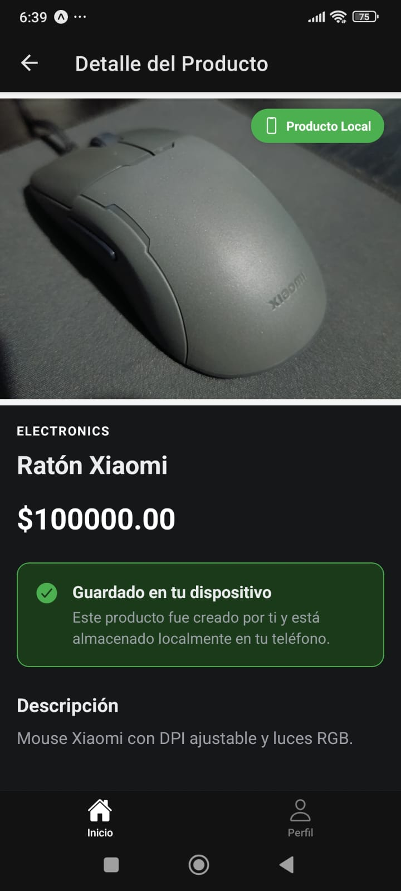

# 🛍️ Products App

Aplicación móvil de catálogo de productos con autenticación JWT, desarrollada con React Native y Expo. Permite consultar productos de una API pública y crear productos locales almacenados en el dispositivo.

## ✨ Características

- 🔐 **Autenticación JWT** - Login seguro con tokens de autenticación
- 📱 **Productos de API** - Integración con [FakeStore API](https://fakestoreapi.com/)
- 💾 **Productos Locales** - Crea y guarda productos en tu dispositivo
- 📸 **Captura de Imágenes** - Toma fotos o selecciona de la galería
- 🎨 **Tema Claro/Oscuro** - Soporte completo para ambos modos
- 📋 **Validación de Formularios** - Usando Formik y Yup
- 💫 **Persistencia de Datos** - AsyncStorage con Zustand
- 🌐 **Interfaz en Español** - UI completamente traducida

## 📸 Preview

<div align="center">
  
  
  
</div>

<div align="center">
  
  
  
</div>

## 🚀 Tecnologías

- **[React Native](https://reactnative.dev/)** - Framework para desarrollo móvil
- **[Expo](https://expo.dev/)** - Plataforma y herramientas
- **[Expo Router](https://docs.expo.dev/router/introduction/)** - Navegación basada en archivos
- **[TypeScript](https://www.typescriptlang.org/)** - Tipado estático
- **[Zustand](https://zustand-demo.pmnd.rs/)** - Gestión de estado
- **[AsyncStorage](https://react-native-async-storage.github.io/async-storage/)** - Persistencia local
- **[Formik](https://formik.org/)** - Manejo de formularios
- **[Yup](https://github.com/jquense/yup)** - Validación de esquemas
- **[Expo Image Picker](https://docs.expo.dev/versions/latest/sdk/imagepicker/)** - Selección de imágenes

## 🏗️ Arquitectura

El proyecto sigue una **arquitectura limpia (Clean Architecture)** con separación de capas:

```
├── app/                    # Capa de presentación (UI y rutas)
│   ├── (products-app)/     # Rutas autenticadas
│   ├── auth/               # Rutas de autenticación
│   └── index.tsx           # Punto de entrada
│
├── core/                   # Lógica de negocio
│   ├── auth/
│   │   ├── actions/        # Acciones de negocio
│   │   ├── api/            # Cliente API
│   │   └── interfaces/     # Tipos y contratos
│   ├── products/
│   │   ├── actions/
│   │   ├── api/
│   │   └── interfaces/
│   └── common/
│       └── api/            # HTTP Client
│
└── presentation/           # Estado y UI componentes
    ├── auth/
    │   └── store/          # Zustand stores
    └── products/
        └── store/
```

## 📦 Instalación

1. **Clona el repositorio**

   ```bash
   git clone <repository-url>
   cd products-app
   ```

2. **Instala las dependencias**

   ```bash
   npm install
   ```

3. **Inicia el proyecto**

   ```bash
   npx expo start
   ```

4. **Ejecuta en tu dispositivo**
   - Escanea el QR con la app Expo Go (Android/iOS)
   - O presiona `a` para Android emulator
   - O presiona `i` para iOS simulator

## 🎯 Uso

### Autenticación

Usa las siguientes credenciales de prueba de FakeStore API:

- **Usuario:** `mor_2314`
- **Contraseña:** `83r5^_`

### Crear Producto Local

1. Haz clic en el botón flotante **+** en la pantalla principal
2. Selecciona una imagen (galería o cámara)
3. Completa el formulario:
   - Título
   - Precio
   - Categoría
   - Descripción
4. Presiona **Crear Producto**

Los productos locales:

- ✅ Se guardan en el dispositivo (AsyncStorage)
- ✅ Persisten entre sesiones
- ✅ Se identifican con un badge verde "Local"
- ✅ Se muestran al inicio de la lista

## 🗂️ Estructura de Datos

### Producto Local

```typescript
interface Product {
  id: number; // Negativo para productos locales
  title: string;
  price: number;
  description: string;
  category: string;
  image: string; // Base64 para productos locales
  rating: {
    rate: number;
    count: number;
  };
  isLocal?: boolean; // Flag para identificar productos locales
}
```

## 🔑 Características de Seguridad

- ✅ Tokens JWT almacenados de forma segura
- ✅ Inyección automática de tokens en requests
- ✅ Validación de autenticación en cada navegación
- ✅ Logout seguro que limpia el almacenamiento

## 🎨 Personalización

### Temas

Los temas se definen en `constants/theme.ts`:

- Color tint personalizable
- Soporte automático dark/light mode
- Esquema de colores consistente

### API

Para cambiar la API de productos, modifica:

- `core/products/api/productsApi.ts`
- `core/products/actions/products-actions.ts`

## 🧪 Testing

```bash
# Ejecutar tests (si los hay configurados)
npm test
```

## 📱 Compatibilidad

- ✅ iOS 13+
- ✅ Android 5.0+
- ✅ Expo Go
- ✅ Desarrollo con Expo Dev Client

## 🤝 Contribuir

Las contribuciones son bienvenidas. Para cambios importantes:

1. Fork el proyecto
2. Crea tu rama de feature (`git checkout -b feature/AmazingFeature`)
3. Commit tus cambios (`git commit -m 'Add: amazing feature'`)
4. Push a la rama (`git push origin feature/AmazingFeature`)
5. Abre un Pull Request

## 📄 Licencia

Este proyecto es de código abierto y está disponible bajo la [MIT License](LICENSE).

## 👨‍💻 Autor

Desarrollado como proyecto educativo para aprender React Native y Expo (basado en el curso de Fernando Herrera).

## 🙏 Agradecimientos

- [FakeStore API](https://fakestoreapi.com/) por proporcionar la API gratuita
- [Expo Team](https://expo.dev/) por las excelentes herramientas
- Comunidad de React Native

---
